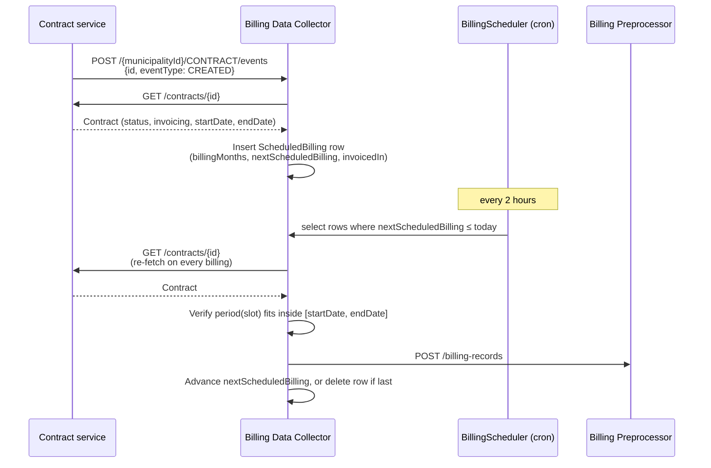

# BillingDataCollector

_The service schedules and perform billings._

### Prerequisites

- **Java 25 or higher**
- **Maven**
- **MariaDB**
- **Git**

### Installation

1. **Clone the repository:**

```bash
git clone https://github.com/Sundsvallskommun/api-service-billing-data-collector.git
cd api-service-billing-data-collector
```

2. **Configure the application:**

   Before running the application, you need to set up configuration settings.
   See [Configuration](#configuration)

   **Note:** Ensure all required configurations are set; otherwise, the application may fail to start.

3. **Ensure dependent services are running:**

   *Messaging*

   - Purpose: Used to send emails.
   - Repository: https://github.com/Sundsvallskommun/api-service-messaging
   - Setup Instructions: See documentation in repository above for installation and configuration steps.

   *Open-E Platform*
   - Purpose: Used to fetch data from the Open-E platform.

   *Party*
   - Purpose: Used to translate party ids to legal ids.
   - Repository: https://github.com/Sundsvallskommun/api-service-party
   - Setup Instructions: See documentation in repository above for installation and configuration steps.

   *Billing-Preprocessor*
   - Purpose: Used to create billing records.
   - Repository: https://github.com/Sundsvallskommun/api-service-billing-preprocessor
   - Setup Instructions: See documentation in repository above for installation and configuration steps.

4. **Build and run the application:**

- Using Maven:

```bash
mvn spring-boot:run
```

- Using Gradle:

```bash
gradle bootRun
```

## API Documentation

Access the API documentation via:

- **Swagger UI:** [http://localhost:8080/api-docs](http://localhost:8080/api-docs)

## Usage

### API Endpoints

See the [API Documentation](#api-documentation) for detailed information on available endpoints.

### Example Request

```bash
curl -X 'POST' 'https://localhost:8080/2281/trigger/12345'
```

## Billing Logic

The service runs **two pipelines side by side**: a *legacy OpenE-pull pipeline*
(triggered by cron, fetches XML forms from the Open-E Platform) and a
*contract-driven event pipeline* (driven by webhook events from the Contract
service). This section describes the **contract pipeline** — the legacy
pipeline is documented inline in `service.scheduling.billing.BillingScheduler`.

### High-level flow



The contract is re-fetched on every scheduler tick so that any change made
in the Contract service since the last event takes immediate effect.

### Slots, periods and the ADVANCE/ARREARS shift

A *slot* is a calendar moment derived from the contract's invoicing
interval:

|  Interval   |                           Slots (always day 1)                            |
|-------------|---------------------------------------------------------------------------|
| MONTHLY     | 1 of every month                                                          |
| QUARTERLY   | 1 Mar, 1 Jun, 1 Sep, 1 Dec                                                |
| HALF_YEARLY | 1 Jun, 1 Dec                                                              |
| YEARLY      | 1 Dec (1 Jun for LAND_LEASE_RESIDENTIAL whose current period ends 30 Jun) |

A *period* is the span of time the invoice on a slot covers. ADVANCE bills
for the *next* period; ARREARS bills for the period *around* the slot:

```
QUARTERLY example:

         Q1                Q2                Q3                Q4
         |---|---|---|     |---|---|---|     |---|---|---|     |---|---|---|
slot:    1 Mar             1 Jun             1 Sep             1 Dec

ADVANCE  ─────────────────► covers Q2        ───► covers Q3    ───► covers Q4
ARREARS  ◄───── covers Q1   ◄──── covers Q2  ◄──── covers Q3   ◄──── covers Q4
```

ADVANCE on 1 Mar bills for April–June (the upcoming quarter). ARREARS on
1 Mar bills for January–March (the quarter that contains the slot).

### Initial billing date when a contract is created

Computed by `ContractEventService.calculateStartFrom`:

- **ADVANCE**: the next slot on or after `contract.startDate`. If
  `startDate` lies in the past, the lower bound is *clamped to today* so
  the system never schedules a billing for a slot that has already passed.
- **ARREARS**: the slot **after** the first slot on or after `startDate`.
  We skip that first slot because its period would start before the
  contract.

Either way, any time gap between the contract's start and the first
scheduled billing is covered by a *manual invoice*. The system does not
attempt to bill partial periods automatically.

### What happens when the contract gets an end date

When a contract is terminated or otherwise gets an `endDate`, BDC re-checks
on every scheduler tick whether the period covered by the next slot still
fits inside the contract:

```mermaid
flowchart TD
    Tick[Scheduler picks up entity] --> Fetch[Re-fetch contract]
    Fetch --> Q1{period&#40;slot&#41;.end &gt; contract.endDate?}
    Q1 -- yes --> Skip[Skip — no invoice sent.<br/>Delete the schedule.]
    Q1 -- no --> Send[Send invoice via Billing Preprocessor]
    Send --> Q2{period&#40;nextSlot&#41;.end &gt; contract.endDate?}
    Q2 -- yes --> Last[This was the last billing.<br/>Delete the schedule.]
    Q2 -- no --> Advance[Advance nextScheduledBilling to nextSlot]
```



Same rule for ADVANCE and ARREARS — only the *period* differs.

### Concrete examples

| Interval / direction |    Slot    |   endDate   |                              Outcome                              |
|----------------------|------------|-------------|-------------------------------------------------------------------|
| YEARLY ADVANCE       | 1 Dec 2026 | 14 Mar 2027 | Skip — the Jan–Dec 2027 period extends past 14 Mar 2027           |
| QUARTERLY ADVANCE    | 1 Jun 2026 | 14 Mar 2027 | Send Q3 (Jul-Sep) and Q4 (Oct-Dec) 2026, then stop before Q1 2027 |
| YEARLY ARREARS       | 1 Dec 2026 | 14 Mar 2027 | Send Jan–Dec 2026 invoice, then stop                              |
| QUARTERLY ARREARS    | 1 Jun 2026 | 14 Apr 2026 | Skip — Q2 (Apr-Jun 2026) extends past 14 Apr 2026                 |

Anything that doesn't fit a full slot's period — the gap between
`contract.startDate` and the first scheduled billing, the gap between the
last scheduled billing and `contract.endDate`, and any credit needed when
an ADVANCE invoice has already been sent for a period that the contract
no longer covers — is handled by **manual invoices** outside this service.

### Mid-contract changes: cadence or direction

The Contract service can change two parts of a contract's invoicing after
billings have already been sent:

- **Direction**: `invoicedIn` flips between ADVANCE and ARREARS. The same
  calendar slot now points at a different period:

  ```
  QUARTERLY, slot = 1 Sep:

   ADVANCE on 1 Sep  ─────► covers Q4 (Oct-Dec)
   ARREARS on 1 Sep  ◄────  covers Q3 (Jul-Sep)
  ```
- **Cadence**: `invoiceInterval` changes between MONTHLY / QUARTERLY /
  HALF_YEARLY / YEARLY. The set of billing slots changes entirely (e.g.
  YEARLY = 1 Dec; QUARTERLY = 1 Mar / 1 Jun / 1 Sep / 1 Dec).

In both cases the existing `nextScheduledBilling` parks the entity on a
slot that no longer matches the contract. The service detects this — for
direction via the persisted `invoiced_in` column on `scheduled_billing`,
for cadence via `billing_months` — and **recomputes
`nextScheduledBilling`** through `calculateStartFrom`. A `WARN` is logged
so the operator can take action.

**What the service does NOT do automatically:**

- Issue a credit for an ADVANCE invoice already sent for a period the
  contract no longer covers (e.g. switching ARREARS-after the fact, or
  shrinking from YEARLY to QUARTERLY).
- Issue a catch-up invoice for a period that falls between the old and
  new schedule (e.g. switching QUARTERLY ADVANCE → YEARLY ADVANCE in
  September would skip Q4 entirely; the previous quarterly slot is gone
  and the new yearly slot doesn't cover it).
- Re-bill a year/quarter/month if the new cadence happens to overlap with
  what was already billed.

**Operator responsibility on any mid-contract change:**

1. Pull the current schedule via
   `GET /{municipalityId}/scheduled-billing/external/{source}/{externalId}` —
   note the new `nextScheduledBilling`.
2. Pull the billing history (this service stores it in `history`; the
   Billing Preprocessor is the source of truth for what was sent to the
   customer).
3. Decide whether any period is now (a) double-covered, (b) uncovered, or
   (c) fine.
4. Issue a manual credit invoice in the Billing Preprocessor for any
   overlap; issue a manual additional invoice for any gap.

The expected use of these changes is rare and tied to a configuration
correction; a contract under normal operation does not change direction
or cadence.

### Files involved

|                          Concern                           |                                            File                                             |
|------------------------------------------------------------|---------------------------------------------------------------------------------------------|
| Inbound events (CREATED/UPDATED/DELETED/TERMINATED)        | `api/CollectorResource.java`, `service/ContractEventService.java`                           |
| Schedule storage                                           | `integration/db/model/ScheduledBillingEntity.java`, Flyway migrations under `db/migration/` |
| Scheduler cron job                                         | `service/scheduling/BillingScheduler.java`                                                  |
| Per-billing logic (re-fetch, period check, send)           | `service/source/contract/ContractBillingHandler.java`                                       |
| Period computation (used both by handler and invoice text) | `service/util/BillingPeriodCalculator.java`                                                 |
| Invoice content                                            | `service/source/contract/ContractMapper.java`                                               |
| Outbound to Contract                                       | `integration/contract/ContractClient.java`                                                  |
| Outbound to Billing Preprocessor                           | `integration/billingpreprocessor/BillingPreprocessorClient.java`                            |

## Configuration

Configuration is crucial for the application to run successfully. Ensure all necessary settings are configured in
`application.yml`.

### Key Configuration Parameters

- **Server Port:**

```yaml
server:
  port: 8080
```

- **Database Settings**

```yaml
spring:
  datasource:
    driver-class-name: org.mariadb.jdbc.Driver
    username: <db_username>
    password: <db_password>
    url: jdbc:mariadb://<db_host>:<db_port>/<database>
  jpa:
    properties:
      jakarta:
        persistence:
          schema-generation:
            database:
              action: validate
  flyway:
    enabled: <true|false> # Enable if you want to run Flyway migrations
```

```yaml
spring:
  security:
    oauth2:
      client:
        registration:
          messaging:
            client-id: <client-id>
            client-secret: <client-secret>
            authorization-grant-type: client_credentials
          billing-preprocessor:
            client-id: <client-id>
            client-secret: <client-secret>
            authorization-grant-type: client_credentials
          party:
            client-id: <client-id>
            client-secret: <client-secret>
            authorization-grant-type: client_credentials
        provider:
          messaging:
            token-uri: <token-uri>
          billing-preprocessor:
            token-uri: <token-uri>
          party:
            token-uri: <token-uri>
integration:
  messaging:
  	base-url: <messaging-url>
  	connect-timeout: 5000
  	read-timeout: 30000
  	oauth2:
      token-url: <token-url>
      authorization-grant-type: <authorization-grant-type>
  party:
    base-url: <party-url>
    connect-timeout: 5000
    read-timeout: 30000
    oauth2:
      token-url: <token-url>
      authorization-grant-type: <authorization-grant-type>
  billing-preprocessor:
    base-url: <billing-preprocessor-url>
    connect-timeout: 5000
    read-timeout: 30000
    oauth2:
      token-url: <token-url>
      authorization-grant-type: <authorization-grant-type>
  opene:
    username: <opene-username>
    password: <opene-password>
    base-url: <opene-url>
    connect-timeout: 5000
    read-timeout: 30000
    oauth2:
      token-url: <token-url>
      authorization-grant-type: <authorization-grant-type>
```

- **Scheduler Settings**

```yaml
scheduler:
  opene:
    cron:
      expression: <cron-expression>
  fallout:
    cron:
      expression: <cron-expression>
falloutreport:
  recipients: <list-of-recipients>
  sender: <sender-email-address>
  sender-name: <sender-name>
  fallout-mail-template:
    subject: <email-subject>
    html-prefix: <html-prefix>
    body-prefix: <body-prefix>
    list-prefix: <html-suffix>
    list-item: <html-list-item>
    list-suffix: <html-list-suffix>
    body-suffix: <body-suffix>
    html-suffix: <html-suffix>
```

### Database Initialization

The project is set up with [Flyway](https://github.com/flyway/flyway) for database migrations. Flyway is disabled by
default so you will have to enable it to automatically populate the database schema upon application startup.

```yaml
spring:
  flyway:
    enabled: true
```

- **No additional setup is required** for database initialization, as long as the database connection settings are
  correctly configured.

### Additional Notes

- **Application Profiles:**

  Use Spring profiles (`dev`, `prod`, etc.) to manage different configurations for different environments.

- **Logging Configuration:**

  Adjust logging levels if necessary.

## Contributing

Contributions are welcome! Please
see [CONTRIBUTING.md](https://github.com/Sundsvallskommun/.github/blob/main/.github/CONTRIBUTING.md) for guidelines.

## License

This project is licensed under the [MIT License](LICENSE).

## Status

[](https://sonarcloud.io/summary/overall?id=Sundsvallskommun_api-service-billing-data-collector)
[](https://sonarcloud.io/summary/overall?id=Sundsvallskommun_api-service-billing-data-collector)
[](https://sonarcloud.io/summary/overall?id=Sundsvallskommun_api-service-billing-data-collector)
[](https://sonarcloud.io/summary/overall?id=Sundsvallskommun_api-service-billing-data-collector)
[](https://sonarcloud.io/summary/overall?id=Sundsvallskommun_api-service-billing-data-collector)
[](https://sonarcloud.io/summary/overall?id=Sundsvallskommun_api-service-billing-data-collector)

## 

Copyright (c) 2024 Sundsvalls kommun
